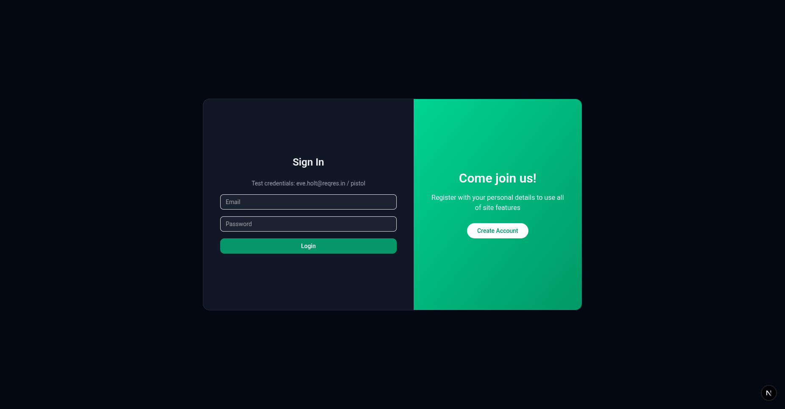

# WorkXloperUz — Next.js App

## Setup Instructions

Prerequisites:
- Node.js 18+ and npm (or yarn/pnpm/bun)
- Create a `.env.local` file in the project root with your environment variables as needed (e.g., NextAuth, API endpoints). Examples:
  - NEXTAUTH_URL=http://localhost:3000
  - NEXTAUTH_SECRET=your_generated_secret

Install dependencies:
- ```bash npm install ```

Run the development server:
- ```bash npm run dev ```
- Open http://localhost:3000 in your browser

Build for production:
- ```bash npm run build ```
- ```bash npm start ```

Lint:
- ```bash npm run lint ```

## Implemented Functionality

- Authentication pages:
  - /login and /register under src/app/(auth)/ with shared layout.
- Dashboard area:
  - /explore with loading state.
  - /profile and /profile/[id] pages.
- Global layout and styles using TailwindCSS (see src/app/globals.css), plus theme toggling.
- Middleware & auth configuration (see src/middleware.ts and src/auth.config.ts).
- User context provider (src/components/user-context.tsx).
- Internationalization groundwork (src/locales/en/common.json).

## Interface Screenshots

## Screenshots

### Login


### Register


### Explore


### Profile


### Home


### Not Found


You can view them directly at:
- http://localhost:3000/screenshots/login.png
- http://localhost:3000/screenshots/register.png
- http://localhost:3000/screenshots/dashboard-explore.png
- http://localhost:3000/screenshots/profile.png

## AI Usage

See AI_USAGE.MD for details on where AI assisted during development. Summary:
- Used ChatGPT to help convert design references into initial login/register layouts using TailwindCSS.
- Assisted in resolving ESLint/TypeScript issues by explaining and iterating on errors.

